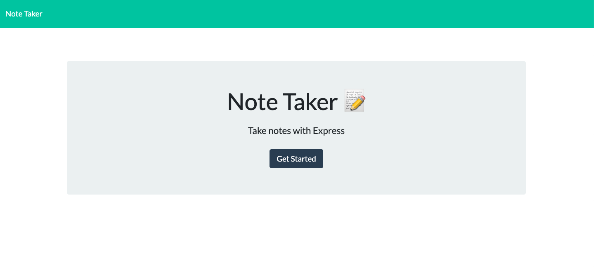
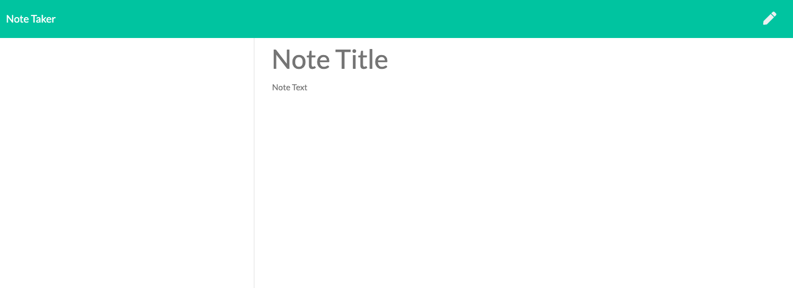
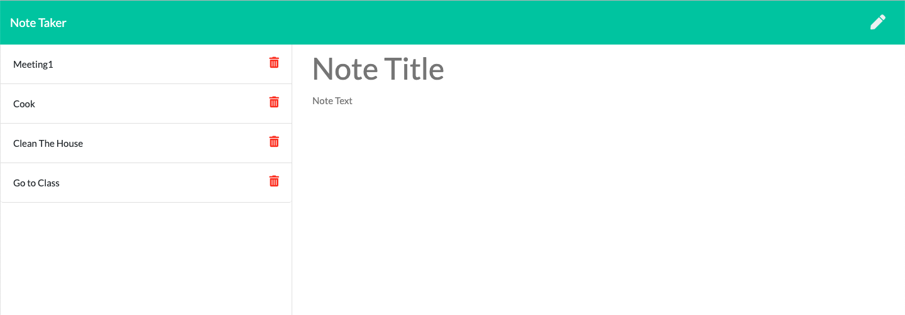
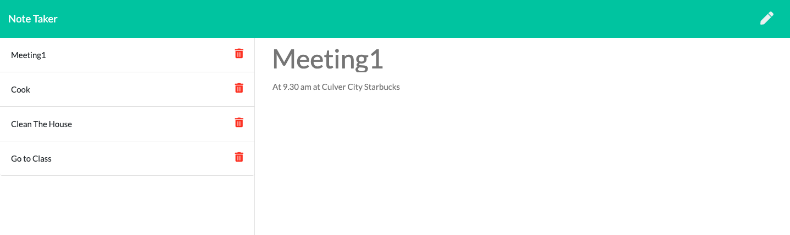
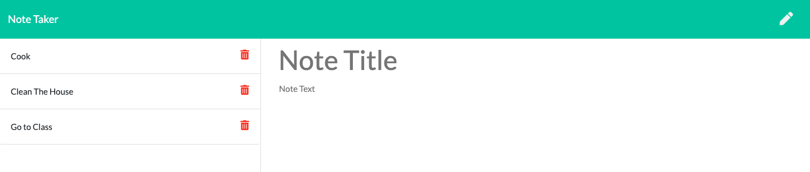

# Note Taker

## About: ##

* This is an application that can be used to write, save, and delete notes. This application uses the express backend and save and retrieve note data from a JSON file (db.json).

## Installation: ##

  * run npm install to install the dependencies since package.json is included.

  * The application has the following directory structure:
    - db/                   //contains db.json which will store all the user saved notes.
    - public/index.html    // The main page
    - public/notes.html   // This is the  page where the user can write and save notes as well as view and delete them.
    - public/assets/css   // contains styles.css file for index.html and notes.html 
    - public/assets/js    // contains index.js which contains the client-side javascript code and server.js which contains the server-side
                          //java script code

  * The running application can be viewed at : 

## Dependencies: ##

    The application depends on the following packages:

  * app-root-path: package that determines the app's root path from anywhere inside the app
  * express": web framework for node
   

## Usage: ##

   - When the user visits ...., he sees the welcome page. When he clicks the "Get Started" button, he's taken to the the page where he can enter his notes.

     
     ---
   - Until the user enters the title and content of the note, the save button will stay hidden. Write button gives the user a new note page to write.

     

     --------------------------------------------------------------

   - When user enters a title and note and clicks the save button, the note will be saved and listed on the left of the page with its title

     

     ---------------------------------------------------------------

   - User can view the note by selecting from the list on the left

    

    -----------------------------------------------------------------
   - User can delete a note and when he does, it is removed from the list on the left of the page as well

   
   

---------------------------------------------------------------------------------------------------------------------------

## How: ##

* The following HTML routes are created:

      - `GET /notes` - Returns the `notes.html` file.

      - `GET *` - Returns the `index.html` file

* The application has a db.json file on the backend that is used to store and retrieve notes using the fs module.

* The following API routes are created:

     - `GET /api/notes` - Reads the db.json file and returns all saved notes as JSON.

     - `POST /api/notes` - Recieves a new note to save on the request body, adds it to the db.json file, and then returns the new note to the client.

     - `DELETE /api/notes/:id` - Recieves a query parameter containing the id of a note to delete. Each note has a unique id when it's saved. ID depends on the order that the notes saved on the file which also corresponds to the order it's listed on the page. In order to delete a note, we read all notes from the `db.json` file, remove the note with the given id property (also states the index of the record in the array of objects), and then rewrite the notes to the db.json file.

## Credits: ## 

I'm greatful for our instructor Omar Patel and TA's Tyler Bray, Matthew Calimbas for their help on the issues encountered in the process of developing this application.

The web sites that I found useful while implementing the application are listed below:

  * https://www.npmjs.com/package/app-root-path
  * https://getbootstrap.com/docs/4.0/getting-started/introduction/
  
## Licence: ##

Anybody is welcomed to copy code snippets and test it out.
